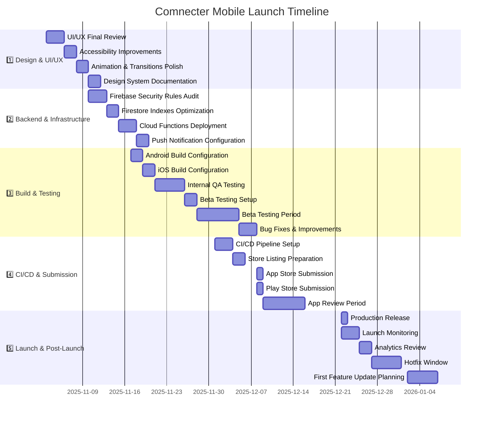

# Comnecter Mobile Launch Timeline

## Executive Summary

This document outlines the timeline for launching Comnecter Mobile on iOS and Android platforms. The launch process is divided into five key phases spanning approximately 6 weeks, with a target launch date of December 22, 2025.

## Visual Timeline

## Key Milestones

| Milestone | Date | Description | Owner |
|-----------|------|-------------|-------|
| Design Freeze | 2025-11-10 | All UI/UX designs finalized | Design Team |
| Backend Ready | 2025-11-20 | Firebase infrastructure complete | Backend Team |
| Beta Launch | 2025-11-28 | TestFlight & Play Store beta release | QA Team |
| Store Submission | 2025-12-08 | Submit to App Store & Play Store | Release Manager |
| Public Launch | 2025-12-22 | Full public availability | Product Team |
| First Update | 2026-01-07 | Post-launch improvements | Development Team |

## Phase Details

### 1️⃣ Design & UI/UX (Nov 3 - Nov 10)
- Complete final design review and adjustments
- Implement accessibility features (contrast, text scaling)
- Polish animations and transitions
- Finalize and document design system

### 2️⃣ Backend & Infrastructure (Nov 10 - Nov 20)
- Audit and optimize Firebase security rules
- Create and test all required Firestore indexes
- Deploy and test Cloud Functions
- Configure push notifications for both platforms

### 3️⃣ Build & Testing (Nov 17 - Dec 8)
- Configure Android and iOS build settings
- Conduct internal QA testing
- Set up and launch beta testing program
- Collect and implement beta feedback
- Fix critical bugs and performance issues

### 4️⃣ CI/CD & Submission (Dec 1 - Dec 15)
- Set up automated build and deployment pipeline
- Prepare store listings (screenshots, descriptions)
- Submit to App Store and Play Store
- Respond to review feedback if needed

### 5️⃣ Launch & Post-Launch (Dec 22 - Jan 7)
- Release to production
- Monitor performance and user feedback
- Review analytics data
- Address critical issues with hotfixes
- Plan first feature update

## Risk Management

| Risk | Impact | Mitigation |
|------|--------|------------|
| App Store rejection | High | Pre-submission review against guidelines, buffer time in schedule |
| Critical bugs during beta | Medium | Comprehensive test plan, prioritized bug fixing |
| Backend scaling issues | Medium | Load testing, monitoring setup, scaling plan |
| User acquisition challenges | Medium | Marketing plan, App Store optimization |
| Subscription processing issues | High | Thorough testing of purchase flows, support plan |

## Success Metrics

- **Launch Day**: 1,000+ downloads, <1% crash rate
- **Week 1**: 5,000+ active users, 4.5+ star rating
- **Month 1**: 10,000+ active users, 5% conversion to paid subscriptions

## Communication Plan

- **Daily**: Team standup meetings during critical phases
- **Weekly**: Stakeholder progress updates
- **Launch Day**: War room setup for immediate issue resolution
- **Post-Launch**: Daily metrics review for first week
