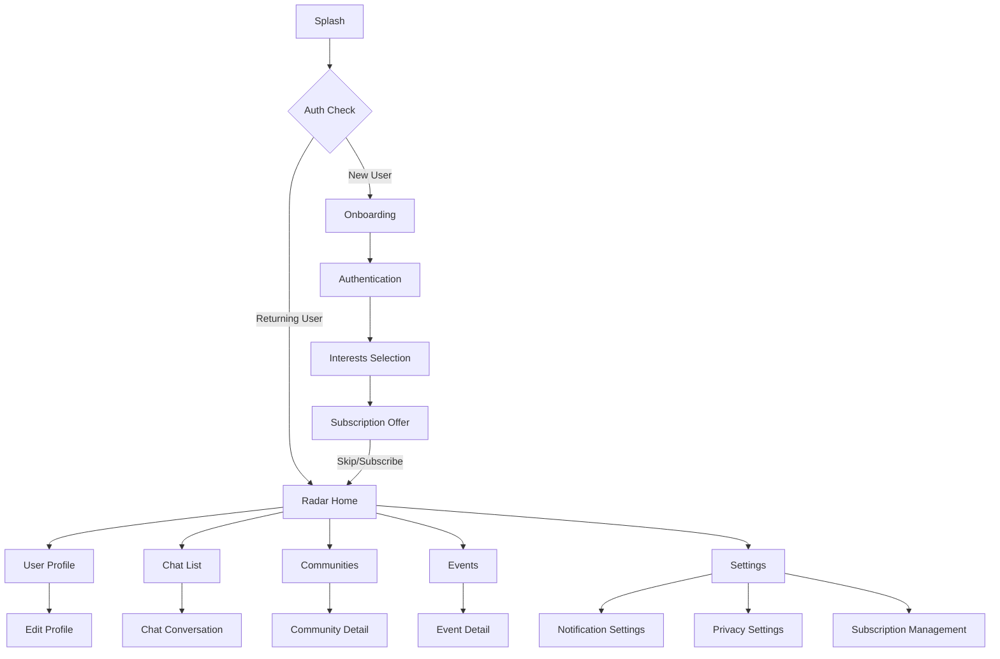
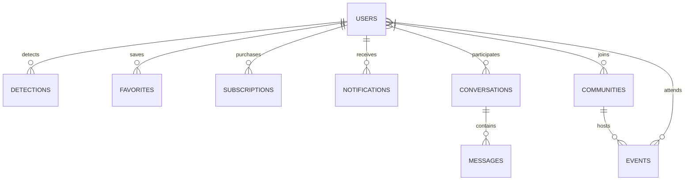
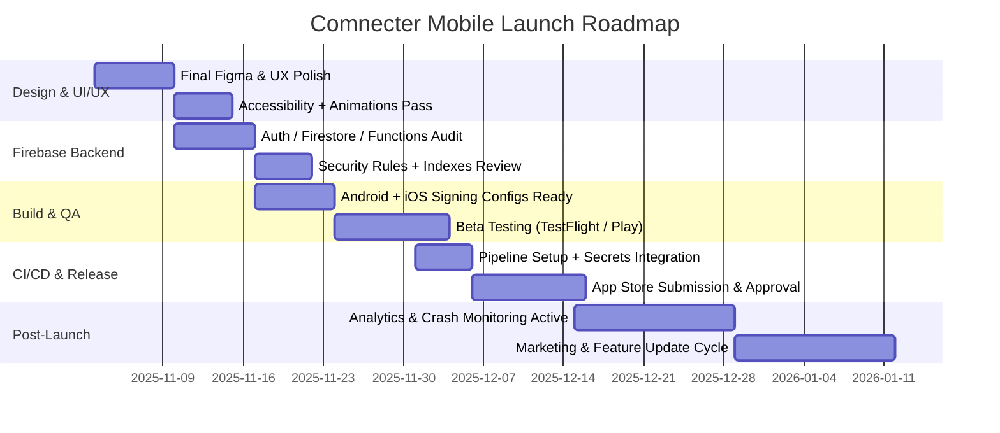

# Comnecter Mobile Production Launch Plan

## 1. Overview & Vision

### Purpose & Mission
Comnecter Mobile is a cross-platform social discovery application built with Flutter and Firebase that enables users to:
- Discover nearby users through radar technology
- Connect through real-time chat
- Create and join communities
- Participate in local events
- Monetize through premium subscription features

### Production Goals & KPIs
- **User Acquisition**: 10,000 DAU within 3 months of launch
- **Engagement**: 15 minutes average session time
- **Retention**: 40% D7 retention, 25% D30 retention
- **Monetization**: 5% conversion to paid subscriptions
- **Performance**: <2s app load time, <1% crash rate
- **Store Rating**: Maintain 4.5+ star rating

### Tech Stack
- **Frontend**: Flutter 3.x (Dart)
- **State Management**: Riverpod (flutter_riverpod, hooks_riverpod)
- **Navigation**: go_router
- **Backend**: Firebase Backend-as-a-Service
  - Authentication
  - Cloud Firestore
  - Cloud Storage
  - Cloud Functions
  - Firebase Messaging
  - Firebase Analytics
  - Firebase Crashlytics
- **CI/CD**: GitHub Actions / Codemagic
- **Monitoring**: Firebase Performance Monitoring, Crashlytics

## 2. UI/UX Structure & Design Audit

### Screen Flow Analysis

| Screen | Purpose | Backend Link | Status | Improvement Notes |
|--------|---------|--------------|--------|-------------------|
| Splash | App initialization, auth check | Firebase Auth | ✅ | Add loading indicators for slow connections |
| Onboarding | First-time user experience | Firestore (user prefs) | ✅ | Add skip option for returning users |
| Authentication | Sign-up/Login | Firebase Auth | ✅ | Add social login options (Google, Apple) |
| Interests Selection | User preference setup | Firestore (user profile) | ⚠️ | Needs categorization and search |
| Subscription | Premium features upsell | Firestore + In-App Purchase | ❌ | Implement subscription tiers and benefits |
| Radar | Core discovery experience | Firestore + Geolocator | ✅ | Optimize refresh rate for battery life |
| Chat | Messaging between users | Firestore + FCM | ✅ | Add media sharing and read receipts |
| Profile | User details and settings | Firestore (user profile) | ⚠️ | Add profile completion percentage |
| Settings | App configuration | Shared Preferences + Firestore | ⚠️ | Add account deletion option |
| Community | Group discovery and interaction | Firestore (communities) | ✅ | Add moderation tools |
| Events | Local event discovery | Firestore (events) | ⚠️ | Add calendar integration |
| Notifications | User alerts | FCM + local notifications | ⚠️ | Add notification categories and preferences |

### Missing Screens to Implement
- **User Blocking/Reporting**: For safety and moderation
- **Help & Support**: FAQ and contact options
- **Feedback Collection**: In-app feedback mechanism
- **Offline Mode**: Limited functionality when disconnected

### Navigation Flow Diagram



## 3. Firebase Backend Architecture

### Environment Separation
- **Development**: `comnecter-dev` Firebase project
- **Staging**: `comnecter-staging` Firebase project
- **Production**: `comnecter-prod` Firebase project

### Firebase Services Verification

| Service | Purpose | Status | Configuration Notes |
|---------|---------|--------|---------------------|
| Authentication | User identity management | ✅ | Email/password, Google, Apple Sign-In |
| Firestore | NoSQL database | ✅ | Implement caching strategy |
| Cloud Storage | Media storage | ✅ | Set up security rules and CORS |
| Cloud Functions | Backend logic | ⚠️ | Implement notification triggers |
| Firebase Messaging | Push notifications | ⚠️ | Configure APNs for iOS |
| Analytics | User behavior tracking | ✅ | Set up custom events |
| Crashlytics | Crash reporting | ✅ | Implement custom keys |
| Remote Config | Feature flags | ❌ | Set up A/B testing |

### Firestore Collections Structure

| Collection | Purpose | Indexes Needed | Security Level |
|------------|---------|----------------|---------------|
| users | User profiles | email, createdAt, lastActive | High |
| conversations | Chat metadata | participantIds, lastMessageTime | High |
| messages | Chat content | conversationId, timestamp | High |
| communities | Group information | tags, memberCount, createdAt | Medium |
| events | Local gatherings | location, startTime, tags | Medium |
| detections | Radar history | userId, detectedAt | High |
| favorites | Saved users | userId, savedAt | High |
| subscriptions | Premium status | userId, endDate, status | High |
| notifications | User alerts | userId, isRead, timestamp | Medium |

### Data Flow Diagram



### Security Rules Sample

```javascript
// Firestore security rules
rules_version = '2';
service cloud.firestore {
  match /databases/{database}/documents {
    // User profiles - users can read public profiles but only edit their own
    match /users/{userId} {
      allow read;
      allow create: if request.auth != null;
      allow update, delete: if request.auth.uid == userId;
    }
    
    // Conversations - only participants can access
    match /conversations/{conversationId} {
      allow read, write: if request.auth != null && 
        request.auth.uid in resource.data.participantIds;
    }
    
    // Messages - only participants of the conversation can access
    match /messages/{messageId} {
      allow read, write: if request.auth != null && 
        exists(/databases/$(database)/documents/conversations/$(resource.data.conversationId)) &&
        request.auth.uid in get(/databases/$(database)/documents/conversations/$(resource.data.conversationId)).data.participantIds;
    }
  }
}
```

## 4. Flutter Codebase & Architecture

### Folder Structure Analysis

```
lib/
├── features/            # Feature-based modules
│   ├── auth/            # Authentication
│   ├── chat/            # Messaging
│   ├── community/       # Communities
│   ├── discover/        # Discovery feed
│   ├── monetization/    # Subscriptions
│   ├── notifications/   # Notifications
│   ├── radar/           # Radar functionality
│   └── settings/        # App settings
├── models/              # Data models
├── services/            # Global services
├── theme/               # UI theme
├── utils/               # Utility functions
└── widgets/             # Reusable widgets
```

### State Management Pattern
- **Riverpod**: Used for dependency injection and state management
- **Repository Pattern**: Data access layer between UI and Firebase
- **Service Locator**: For global service access

### Navigation Strategy
- **go_router**: Declarative routing with path-based navigation
- **Navigation Guards**: Authentication state checks before route access
- **Deep Linking**: Support for external app links

### Environment Separation
- **Firebase Options**: Separate configurations for dev/staging/prod
- **Flavor Management**: Using build variants for different environments
- **Feature Flags**: Remote Config for gradual feature rollout

### pubspec.yaml Audit

| Dependency | Purpose | Version | Status | Notes |
|------------|---------|---------|--------|-------|
| flutter_riverpod | State management | ^2.4.9 | ✅ | Latest version |
| hooks_riverpod | Hooks integration | ^2.4.9 | ✅ | Latest version |
| go_router | Navigation | ^12.1.3 | ✅ | Latest version |
| google_maps_flutter | Maps | ^2.5.0 | ✅ | Latest version |
| geolocator | Location services | ^10.1.0 | ✅ | Latest version |
| firebase_core | Firebase base | ^2.24.2 | ✅ | Latest version |
| firebase_auth | Authentication | ^4.15.3 | ✅ | Latest version |
| cloud_firestore | Database | ^4.13.6 | ✅ | Latest version |
| firebase_storage | Storage | ^11.5.6 | ✅ | Latest version |
| firebase_messaging | Push notifications | ^14.7.10 | ✅ | Latest version |
| firebase_analytics | Analytics | ^10.7.4 | ✅ | Latest version |
| firebase_crashlytics | Crash reporting | ^3.4.8 | ✅ | Latest version |
| intl | Internationalization | ^0.20.2 | ✅ | Latest version |

### Performance Optimization
- **Asset Compression**: Optimize images and sounds
- **Code Splitting**: Lazy loading for non-critical features
- **Memory Management**: Dispose controllers and listeners
- **Network Caching**: Implement Firestore offline persistence

## 5. Build Configuration

### Android Configuration

#### Gradle Settings (android/app/build.gradle)
```gradle
android {
    compileSdkVersion 34
    
    defaultConfig {
        applicationId "com.example.comnecter_mobile"
        minSdkVersion 21
        targetSdkVersion 34
        versionCode flutterVersionCode.toInteger()
        versionName flutterVersionName
    }

    signingConfigs {
        release {
            keyAlias keystoreProperties['keyAlias']
            keyPassword keystoreProperties['keyPassword']
            storeFile keystoreProperties['storeFile'] ? file(keystoreProperties['storeFile']) : null
            storePassword keystoreProperties['storePassword']
        }
    }
    
    buildTypes {
        release {
            signingConfig signingConfigs.release
            minifyEnabled true
            shrinkResources true
            proguardFiles getDefaultProguardFile('proguard-android.txt'), 'proguard-rules.pro'
        }
    }
}
```

#### key.properties (android/key.properties)
```
storePassword=<password>
keyPassword=<password>
keyAlias=upload
storeFile=../upload-keystore.jks
```

#### Release Build Command
```bash
flutter build appbundle --release
```

### iOS Configuration

#### Xcode Project Settings
- **Bundle Identifier**: com.example.comnecterMobile
- **Version**: 1.0.0
- **Build**: 3
- **Deployment Target**: iOS 12.0+
- **Capabilities**: Push Notifications, Background Modes (location, fetch)

#### Info.plist Permissions
```xml
<key>NSLocationWhenInUseUsageDescription</key>
<string>Comnecter needs your location to find people nearby</string>
<key>NSLocationAlwaysAndWhenInUseUsageDescription</key>
<string>Comnecter needs your location to find people nearby even when the app is in the background</string>
<key>NSCameraUsageDescription</key>
<string>Comnecter needs camera access to let you take profile pictures</string>
<key>NSPhotoLibraryUsageDescription</key>
<string>Comnecter needs photo library access to let you choose profile pictures</string>
<key>NSMicrophoneUsageDescription</key>
<string>Comnecter needs microphone access for voice messages</string>
```

#### Release Build Command
```bash
flutter build ipa --release
```

### Versioning Strategy
- **Semantic Versioning**: MAJOR.MINOR.PATCH (e.g., 1.0.0)
- **Build Number**: Incremental integer (e.g., +3)
- **Version Bump Automation**: CI/CD triggered

### Changelog Management
- **CHANGELOG.md**: Maintain detailed version history
- **Release Notes**: User-friendly summaries for store listings

## 6. QA & Testing Workflow

### Automated Testing

| Test Type | Coverage Target | Tools | Status |
|-----------|-----------------|-------|--------|
| Unit Tests | Core business logic | flutter_test | ⚠️ |
| Widget Tests | UI components | flutter_test | ❌ |
| Integration Tests | User flows | integration_test | ❌ |
| Golden Tests | UI appearance | golden_toolkit | ❌ |

### Manual QA Matrix

| Platform | Devices | OS Versions | Screen Sizes | Network Conditions |
|----------|---------|-------------|--------------|-------------------|
| Android | Pixel 6, Samsung S22, OnePlus | 10, 11, 12, 13 | Small, Medium, Large | WiFi, 4G, 3G, Offline |
| iOS | iPhone SE, iPhone 13, iPhone 14 Pro | 14, 15, 16 | Small, Medium, Large | WiFi, 4G, 3G, Offline |

### Beta Testing
- **iOS**: TestFlight with 100 external testers
- **Android**: Play Console Open Testing track
- **Feedback Collection**: In-app form + Firebase Crashlytics

### QA Checklist
- ✅ App launches successfully on all test devices
- ✅ Authentication flow works (signup, login, password reset)
- ✅ Core radar functionality detects nearby users
- ✅ Chat messages send/receive in real-time
- ✅ Push notifications arrive when app is in background
- ✅ Location permissions properly requested and handled
- ✅ App handles network interruptions gracefully
- ✅ Subscription purchase flow completes successfully
- ✅ Deep links open correct screens
- ✅ App respects system dark/light mode

## 7. CI/CD Automation

### GitHub Actions Pipeline

```yaml
name: Flutter CI/CD

on:
  push:
    branches: [ main, develop ]
  pull_request:
    branches: [ main, develop ]

jobs:
  build:
    runs-on: ubuntu-latest
    steps:
      - uses: actions/checkout@v3
      - uses: subosito/flutter-action@v2
        with:
          flutter-version: '3.16.x'
          channel: 'stable'
      
      - name: Get dependencies
        run: flutter pub get
        
      - name: Run tests
        run: flutter test
        
      - name: Build Android
        run: flutter build appbundle --release
        
      - name: Upload Android Build
        uses: actions/upload-artifact@v3
        with:
          name: android-release
          path: build/app/outputs/bundle/release/app-release.aab
```

### Codemagic Workflow

```yaml
workflows:
  ios-workflow:
    name: iOS Production
    instance_type: mac_mini_m1
    environment:
      vars:
        APP_STORE_CONNECT_ISSUER_ID: ${{ secrets.APP_STORE_CONNECT_ISSUER_ID }}
        APP_STORE_CONNECT_KEY_IDENTIFIER: ${{ secrets.APP_STORE_CONNECT_KEY_IDENTIFIER }}
        APP_STORE_CONNECT_PRIVATE_KEY: ${{ secrets.APP_STORE_CONNECT_PRIVATE_KEY }}
        CERTIFICATE_PRIVATE_KEY: ${{ secrets.CERTIFICATE_PRIVATE_KEY }}
      flutter: stable
    scripts:
      - name: Get Flutter packages
        script: flutter packages pub get
      - name: Build iOS
        script: flutter build ipa --release
      - name: Upload to App Store Connect
        script: xcrun altool --upload-app --type ios --file build/ios/ipa/*.ipa --apiKey $APP_STORE_CONNECT_KEY_IDENTIFIER --apiIssuer $APP_STORE_CONNECT_ISSUER_ID
    artifacts:
      - build/ios/ipa/*.ipa
```

### Secrets Management
- **GitHub Secrets**: For API keys and signing credentials
- **Codemagic Encrypted Environment Variables**: For iOS certificates
- **Firebase Service Account Keys**: For CI/CD deployment

### Branch Structure
- **main**: Production-ready code
- **develop**: Integration branch for features
- **feature/***: Individual feature branches
- **hotfix/***: Emergency fixes for production
- **release/***: Release candidate branches

### Automated Versioning
- **Conventional Commits**: For semantic versioning
- **Git Tags**: For release marking
- **Changelog Generation**: Based on commit messages

## 8. Store Submission Workflow

### Google Play Console Setup
- **App Category**: Social
- **Content Rating**: Teen (13+)
- **Privacy Policy URL**: https://comnecter.com/privacy
- **Data Safety Form**: Location, contacts, media
- **In-App Products**: Subscription tiers
- **Release Tracks**: Internal → Closed Testing → Open Testing → Production

### App Store Connect Setup
- **App Information**: Name, subtitle, keywords
- **App Privacy**: Privacy policy URL, data collection practices
- **App Review Information**: Demo account, contact info
- **TestFlight**: Internal and External testing groups
- **In-App Purchases**: Subscription products

### Store Assets

| Asset | Dimensions | Formats | Notes |
|-------|------------|---------|-------|
| App Icon | 1024x1024 | PNG | No alpha channel for iOS |
| Feature Graphic | 1024x500 | JPG/PNG | For Play Store |
| Screenshots | Device-specific | JPG/PNG | 5-10 per device type |
| App Preview Video | 15-30 seconds | MP4 | Highlight key features |

### Staged Rollout Strategy
- **Android**: 10% → 25% → 50% → 100% over 2 weeks
- **iOS**: Manual review then 100% availability

## 9. Analytics & Monetization

### Firebase Analytics Events

| Event | Parameters | Purpose |
|-------|------------|---------|
| user_signup | method, success | Track signup conversion |
| user_login | method, success | Track login success rate |
| radar_scan | user_count, duration | Measure radar usage |
| chat_initiated | recipient_type | Track conversation starts |
| subscription_view | plan_type | Measure subscription funnel |
| subscription_purchase | plan_type, price, duration | Track monetization |
| profile_view | viewer_id, profile_id | Track profile engagement |
| app_rating | score, feedback | Capture user satisfaction |

### Monetization Strategy
- **Subscription Tiers**:
  - Basic (Free): Limited radar scans, basic chat
  - Premium ($4.99/month): Unlimited radar, advanced filters
  - Pro ($9.99/month): All features + visibility boost

### A/B Testing with Remote Config
- **Test 1**: Subscription CTA placement and messaging
- **Test 2**: Radar scan frequency and range
- **Test 3**: Onboarding flow variations

## 10. Security & Compliance

### Data Protection
- **Data Encryption**: In-transit and at-rest
- **Authentication**: Email verification, secure password policy
- **Authorization**: Firestore security rules by user role

### Privacy Compliance
- **GDPR**: Data export, deletion requests
- **CCPA**: Do Not Sell My Data option
- **App Tracking Transparency**: iOS permission dialog
- **Children's Privacy**: Age verification gate

### Security Audit Checklist
- ✅ API keys and secrets not hardcoded
- ✅ Firebase security rules properly configured
- ✅ Network requests use HTTPS
- ✅ Authentication tokens securely stored
- ✅ Sensitive data not logged
- ✅ App-level encryption for chat messages
- ✅ Certificate pinning for API requests

### Privacy Policy Requirements
- Data collection practices
- Third-party services
- User rights and controls
- Retention periods
- Contact information

## 11. Documentation & Team Handover

### Documentation Structure
- **README.md**: Project overview and setup
- **ARCHITECTURE.md**: System design and patterns
- **CONTRIBUTING.md**: Development workflow
- **RELEASE.md**: Release process
- **API.md**: Backend API documentation

### Developer Onboarding
- Environment setup guide
- Codebase walkthrough
- Firebase console access
- Testing procedures

### Release Runbook
1. Feature freeze and code review
2. Version bump and changelog update
3. QA testing on staging environment
4. Release branch creation
5. Final regression testing
6. Store submission and review
7. Staged rollout monitoring
8. Post-launch analytics review

## 12. 📅 Launch Timeline (Gantt Roadmap)



### Critical Path Milestones
1. **2025-11-10**: Design freeze and final UI assets
2. **2025-11-17**: Backend architecture audit complete
3. **2025-11-24**: Build configurations and signing ready
4. **2025-12-04**: Beta testing feedback incorporated
5. **2025-12-08**: CI/CD pipeline fully operational
6. **2025-12-15**: Store submissions complete
7. **2025-12-22**: Full production launch
8. **2026-01-05**: First post-launch update

### Risk Assessment
- App Store review delays: Build in 1-week buffer
- Firebase quota limits: Monitor usage during beta
- Performance on older devices: Include in test matrix
- User acquisition challenges: Prepare marketing assets early
